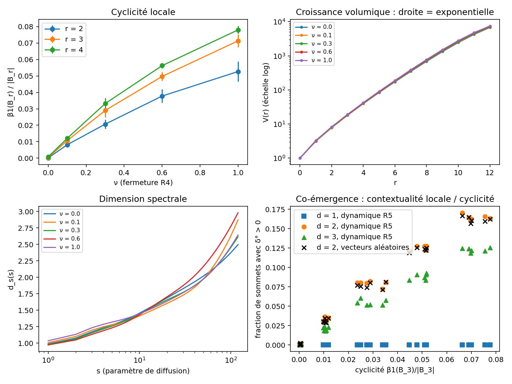

# Auto-structuration d'espaces probabilistes relationnels

**Programme de recherche pré-géométrique, concurrent et sans horloge globale primitive**

Pour Melchior et Joanne, vous m'offrez une source d'inspiration inépuisable ❤️

Guillaume Berthelot

> *English summary.* This repository contains a research programme (in French) exploring whether space, time, material persistence and local subsystems can emerge from a relational probabilistic information structure with no primitive local objects and no global clock. It provides a formal framework (true-concurrency semantics, admissible cuts, sparse unimodular limits), two fully specified toy models, an explicit link to contextuality through Vorob'ev's theorem, and Python simulations with preliminary — partly negative — results. It is a programme, not a finished theory.

---

## Statut

Ce dépôt présente un **programme de recherche**, non une théorie achevée. Il ne prétend dériver ni la mécanique quantique, ni la règle de Born, ni la gravité. Il propose un cadre formel, deux modèles jouets entièrement spécifiés, une liste explicite de critères d'échec, et des simulations dont certains résultats sont négatifs. Les critiques sont bienvenues.

## La question

> Existe-t-il une classe simple de structures informationnelles et de lois d'actualisation à partir desquelles des représentations stables — système local, matière, géométrie, temps — émergent sans avoir été posées dans les prémisses, et dont une extension contextuelle non classique peut reproduire les contraintes quantiques observées ?

## Idées principales

**Hypothèse.** Le niveau primitif est une structure informationnelle probabiliste et relationnelle, non décomposée a priori en sous-systèmes locaux. Les variables, sommets et supports des modèles finis sont des coordonnées de représentation, non des constituants. Deux phénomènes séparés peuvent être deux représentants contextuels d'une même structure non factorisable.

**Sémantique sans horloge globale.** Aucune probabilité n'est attribuée au « prochain événement » parmi tous les événements activables. Quatre régimes sont distingués entre événements co-activables : conflit, dépendance structurelle, couplage probabiliste et indépendance complète. Les probabilités vivent dans les cellules de branchement et dans les lois jointes des blocs couplés ; toute observable doit être indépendante de la linéarisation computationnelle.

**Géométrie.** Un graphe statique est extrait d'une réalisation par des coupes admissibles de l'ordre de dépendance dérivé. Une géométrie n'est retenue que si sa limite locale de Benjamini–Schramm est indépendante du choix de coupe.

**Articulation avec Bell.** Par le théorème de Vorob'ev, toute famille cohérente de distributions contextuelles admet une section globale classique si et seulement si la structure des contextes est acyclique. La non-factorisabilité observable exige donc des cycles, comme la géométrie de dimension finie. D'où une hypothèse falsifiable de **co-émergence** entre géométrisation et capacité contextuelle.

## Les deux modèles jouets

| | Modèle A | Modèle B |
|---|---|---|
| Rôle | Laboratoire classique d'auto-structuration | Couche contextuelle sur la structure produite par A |
| Objets | Hypergraphe, issues ±1, couplages ρ | Vecteurs unitaires w ∈ S^{d−1}, contextes de rang 2 |
| Loi | Spécification de Gibbs locale par bloc | p_k(a_u, a_v) = (1 + c_k a_u a_v)/4, c_k = ⟨w_u, w_v⟩ |
| Règles | R1 renforcement, R2 réouverture, R3 croissance, R4 fermeture de cycles | R5 alignement équivariant sous O(d) |
| Propriétés établies | Indépendance par empreintes disjointes ; taux additifs λ₀\|Λ\| | Non-signalement structurel ; contrôle classique d = 1 ; borne de Tsirelson dans le cas biparti |

## Contenu du dépôt

```
.
├── README.md
├── LICENSE
├── docs/
│   ├── auto_structuration_espaces_probabilistes.pdf
│   └── resume_deux_pages.tex                               # résumé
└── simulations/
    ├── LISEZMOI.md          # protocole détaillé et choix d'implémentation
    ├── requirements.txt
    ├── modele_A.py          # dynamique, journal d'événements, coupes admissibles
    ├── modele_B.py          # contextualité locale et contrôles mathématiques
    ├── observables.py       # cyclicité, croissance volumique, dimension spectrale
    ├── experiences.py       # les deux expériences et les figures
    └── resultats/           # sorties JSON et figures
```

## Reproduire les simulations

```bash
cd simulations
pip install -r requirements.txt
python experiences.py            # version rapide, environ 1 minute
python experiences.py --complet  # 6 graines, jusqu'à 20 000 sommets, environ 15 minutes
```

Le texte se compile avec `pdflatex` (deux passes).

## Résultats préliminaires

Obtenus avec `--complet` (6 graines par valeur de ν, structures de 20 000 sommets).

**Ce qui fonctionne**

- Contrôles mathématiques exacts : formule de section sur les forêts (erreur 10⁻¹⁶), équivalence inégalités de cycle / section globale sans aucun désaccord sur 400 programmes linéaires, borne de Tsirelson atteinte et jamais dépassée.
- Contrôle classique d = 1 parfait : aucune violation de CHSH, S_max = 2 exactement.
- Reconstruction exacte de la configuration finale à partir du journal d'événements.
- Transition nette entre régime absorbant et régime actif dans le plan (βJ, μ).
- La fermeture R4 produit la cyclicité attendue : β₁(B₃)/|B₃| passe de 0 à 0,07 quand ν va de 0 à 1.

**Ce qui ne fonctionne pas encore**

- **La géométrie reste exponentielle.** V(r) croît comme 2ʳ pour toutes les valeurs de ν : R3 crée des branches plus vite que R4 ne les referme. R4 est nécessaire mais pas suffisant.
- **La co-émergence est presque tautologique dans le modèle B.** La contextualité locale croît avec la cyclicité, mais un même graphe muni de vecteurs aléatoires donne le même résultat (0,162 contre 0,164). La dynamique R5 n'y contribue pas : des corrélations contraintes par la dynamique sont nécessaires pour un test réel.
- **Le test d'invariance de section ne discrimine pas encore.** Les coupes comparées se recouvrent à 96 % ; des structures plus grandes et moins arborescentes sont nécessaires.



## Prochaines étapes

1. Obtenir une géométrie de dimension finie : rapport μ/ν, règle de suppression, fermeture à distance 2.
2. Rendre les corrélations contextuelles dépendantes de la dynamique, pour que la co-émergence devienne un test non trivial.
3. Implémenter la persistance sur coupes admissibles (Π⁻, Π⁺) et le test d'invariance d'implémentation parallèle.
4. Rechercher des invariants à forme de flux et des spectres robustes.

## Critères d'échec

Le programme est réfuté, notamment, si les observables dépendent de la linéarisation computationnelle, si la structure reste localement arborescente dans toutes les phases accessibles, ou si aucune extension contextuelle cohérente avec Bell, le non-signalement et les bornes quantiques ne peut être construite. La liste complète figure en section 28 du texte.

## Programmes voisins

Le texte se positionne explicitement par rapport aux ensembles causaux (Rideout–Sorkin), au Wolfram Physics Project, à l'approche en faisceaux de la contextualité (Abramsky–Brandenburger), à quantum graphity, aux quantum causal histories (Markopoulou), au causaloïde (Hardy) et à la localité désordonnée (Markopoulou–Smolin).

## Citer ce travail

```bibtex
@misc{berthelot2026autostructuration,
  author = {Berthelot, Guillaume},
  title  = {Auto-structuration d'espaces probabilistes relationnels :
            programme de recherche pré-géométrique, concurrent et sans horloge globale primitive},
  year   = {2026},
  note   = {Version 10},
  url    = {https://github.com/guillaume117/emergence}
}
```

## Contact

Remarques, objections et propositions de collaboration : guiberthelot@gmail.com, ou via les *issues* du dépôt.

## Licence

Code (`simulations/*.py`) : licence MIT. Texte, documents et figures : licence [CC BY 4.0](https://creativecommons.org/licenses/by/4.0/deed.fr). Voir [`LICENSE`](LICENSE).
