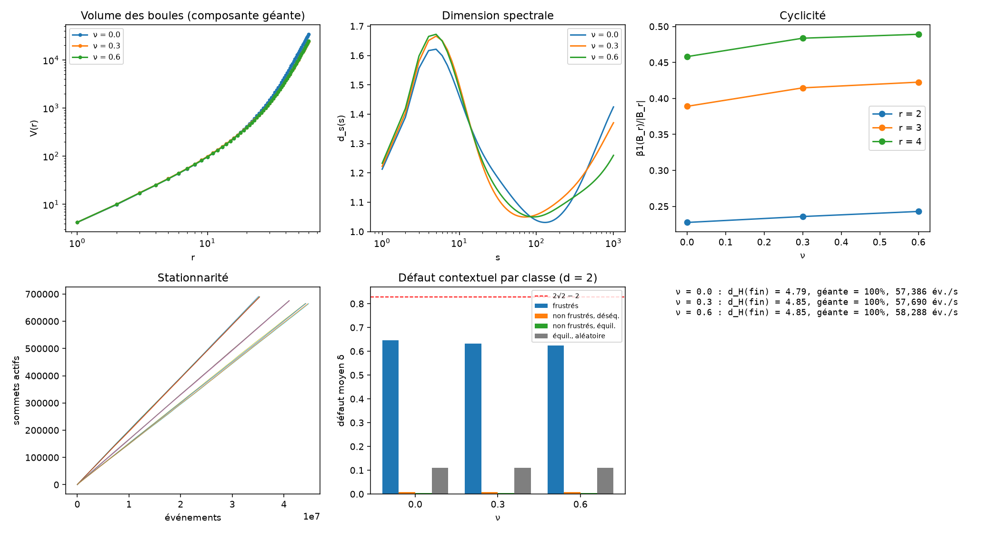

# Auto-structuration d'espaces probabilistes relationnels

**Programme de recherche pré-géométrique, concurrent et sans horloge globale primitive**

Pour Melchior et Joanne, vous m'offrez une source d'inspiration inépuisable ❤️

Guillaume Berthelot

> *English summary.* This repository contains a research programme (in French) exploring whether space, time, material persistence and local subsystems can emerge from a relational probabilistic information structure with no primitive local objects and no global clock. It provides a formal framework (true-concurrency semantics, admissible cuts, sparse unimodular limits), toy models specified down to the code, an explicit link to contextuality through Vorob'ev's theorem, and a C++ simulation engine run up to a million vertices. Results so far: the contextual layer behaves as predicted (Bell-type violations concentrate on frustrated cycles), while every growth rule tested so far yields known non-manifold phases (hyperbolic, branched polymer, supercritical causal growth). The current step is locating a critical point of the causal growth rules. It is a programme, not a finished theory.

**Site de vulgarisation interactif :** [guillaume117.github.io/emergence](https://guillaume117.github.io/emergence/)

---

## Statut

Ce dépôt présente un **programme de recherche**, non une théorie achevée. Il ne prétend dériver ni la mécanique quantique, ni la règle de Born, ni la gravité. Il propose un cadre formel, des modèles jouets entièrement spécifiés, une liste explicite de critères d'échec, et des simulations dont la plupart des résultats géométriques sont, à ce stade, négatifs. Les briques utilisées sont pour l'essentiel connues (voir [Ce qui est déjà connu](#ce-qui-est-déjà-connu)) ; l'apport éventuel du programme tient à leur assemblage. Les critiques sont bienvenues.

## La question

> Existe-t-il une classe simple de structures informationnelles et de lois d'actualisation à partir desquelles des représentations stables — système local, matière, géométrie, temps — émergent sans avoir été posées dans les prémisses, et dont une extension contextuelle non classique peut reproduire les contraintes quantiques observées ?

## Idées principales

**Hypothèse.** Le niveau primitif est une structure informationnelle probabiliste et relationnelle, non décomposée a priori en sous-systèmes locaux. Les variables, sommets et supports des modèles finis sont des coordonnées de représentation, non des constituants.

**Sémantique sans horloge globale.** Aucune probabilité n'est attribuée au « prochain événement » parmi tous les événements activables. Les probabilités vivent dans les cellules de branchement et dans les lois jointes des blocs couplés ; toute observable doit être indépendante de la linéarisation computationnelle.

**Géométrie.** Un graphe statique est extrait d'une réalisation par des coupes admissibles de l'ordre de dépendance dérivé. Une géométrie n'est retenue que si sa limite locale est indépendante du choix de coupe.

**Articulation avec Bell.** Par le théorème de Vorob'ev, toute famille cohérente de distributions contextuelles admet une section globale classique si et seulement si la structure des contextes est acyclique. La non-factorisabilité observable exige donc des cycles, comme la géométrie de dimension finie : d'où une hypothèse falsifiable de **co-émergence** entre géométrisation et capacité contextuelle.

**Contextualité et frustration.** Dans la couche contextuelle, les consignes « pareil / opposé » entre points sont produites par la dynamique classique. Un cycle portant un nombre impair de consignes « opposé » est frustré ; c'est là, et seulement là, que la relaxation vectorielle dépasse la borne classique, jusqu'à la borne quantique n cos(π/n).

## Point d'avancement — 8 octobre 2026

### Chronologie des modèles

| Version | Croissance de la structure | Géométrie obtenue | Volume V(r) | Dimension spectrale | Verdict |
|---|---|---|---|---|---|
| v10 | Branches libres sur un réseau aléatoire | Hyperbolique | V ∝ 2ʳ | – | trop de branches |
| v11 strict | Complétion de carrés, depuis un germe | Polymère branché | d_H ≈ 1,9 | d_s ≈ 1,28 (4/3) | pas une surface |
| v11 libre | Carrés, fermetures sans condition | Fractale intermédiaire | pente 2,2 à 2,8 selon ν | 1,3 à 1,6 | diffusion anormale (d_w ≈ 3) |
| v12 | Losanges causaux, hauteur causale, fluctuations R7± (ζ₊ = ζ₋) | L'espace gonfle à chaque étage | convexe, pente jusqu'à 4,8 | 1,05 à 1,6, sans plateau | branchement supercritique |
| v12 critique | Idem, rapport ζ₋/ζ₊ réglé pour des tranches stationnaires | à mesurer | 2 attendu | 2 attendu | en cours |

Les séries v11 et v12 ont été menées jusqu'à un million de sommets (4 à 6 graines par point) avec le moteur C++ ; voir [`V11/XPV11C++/`](V11/XPV11C++) et [`V12/`](V12).

### Ce qui est établi

- **Le moteur est validé.** Reconstruction exacte de la configuration depuis le journal des dépendances ; observables C++ identiques à la référence Python ; dynamique C++ statistiquement équivalente à la référence (écarts réduits |z| < 2) ; croissance causale pure reproduisant exactement le cylindre plat, indépendamment de l'ordre des événements (invariance causale vérifiée numériquement).
- **La couche contextuelle se comporte comme prévu, dans toutes les versions.** Défaut contextuel moyen d'environ 0,63 à 0,75 sur les cycles frustrés, inférieur à 0,01 dans les composantes équilibrées, contre 0,11 à 0,16 dans toutes les classes pour une référence à vecteurs aléatoires. La contextualité dépend donc de la dynamique et non de l'état initial, ce qui n'était pas le cas en v10.
- **Les régimes géométriques connus sont retrouvés.** La v11 stricte reproduit le couple (d_H, d_s) = (2, 4/3) des arbres aléatoires génériques, confirmé par trois diagnostics indépendants : composante 2-arête-connexe décroissant avec N, environ 22 % de ponts à toutes les tailles, relation d'Alexander–Orbach vérifiée. La v10 retrouve une géométrie hyperbolique de croissance combinatoire.

### Ce qui ne fonctionne pas encore

- **Aucune règle testée ne produit une surface de dimension 2.** Les causes sont identifiées : croissance par cassure puis branchement (v11), puis branchement spatial supercritique (v12), où l'insertion de nouveaux points l'emporte sur leur retrait même à taux égaux.
- **Le test d'invariance de section reste non informatif** : les coupes comparées se recouvrent à plus de 95 %, car la dynamique des issues relie tous les événements entre eux.
- **Le choix des vecteurs unitaires de la couche contextuelle est emprunté** au théorème de Tsirelson ; il est justifié comme relaxation d'une frustration, non dérivé.

### Étape en cours : la criticité du branchement spatial

Comme dans les triangulations dynamiques causales, une géométrie de dimension 2 n'est attendue qu'au point critique où les longueurs de tranches restent stationnaires. Deux leçons de méthode :

1. Le taux m = L(h+1)/L(h) mesuré sous le pic du profil est biaisé (m > 1 par construction) ; un premier balayage fondé sur lui n'a pas trouvé de point critique.
2. Aucune tranche n'est jamais figée : R7± agit dans tout le volume. Le critère retenu est donc la dérive temporelle D des longueurs de tranches. Un premier essai réduit place D = 0 pour ζ₋/ζ₊ entre 5 et 6,5.

Ce réglage tombe sous le critère de réglage fin du programme : s'il donne une surface, il faudra ensuite le justifier par une symétrie des règles plutôt que par un ajustement.



### Prochaines étapes

1. Localiser le point critique (`balayage_criticite.py`), puis mesurer V(r), d_s et d_w à ce point, sur des structures de plusieurs millions de sommets.
2. Si une surface apparaît : remplacer le réglage par une règle critique par construction.
3. Mesurer la persistance dans le vrai modèle, sur les frontières entre domaines d'issues, avec et sans germe tordu (défaut protégé par la topologie).
4. Rendre le test d'invariance de section informatif.

## Ce qui est déjà connu

- Triangulations dynamiques causales : Ambjørn et Loll ([hep-th/9805108](https://arxiv.org/abs/hep-th/9805108)) ; dimensions de la triangulation causale infinie uniforme, Durhuus, Jonsson et Wheater ([0908.3643](https://arxiv.org/abs/0908.3643)). La v12 en est une variante en losanges.
- Arbres aléatoires génériques, dimension spectrale 4/3 : Durhuus, Jonsson et Wheater (2007).
- Géométrie hyperbolique de complexes en croissance : Bianconi et Rahmede ([1607.05710](https://arxiv.org/abs/1607.05710)).
- Inégalités de Bell et systèmes de spins frustrés : Fine (1982) ; Wolf, Verstraete et Cirac ([quant-ph/0311051](https://arxiv.org/abs/quant-ph/0311051)) ; Schmidt ([cond-mat/0604591](https://arxiv.org/abs/cond-mat/0604591)).
- Le texte se positionne aussi par rapport aux ensembles causaux (Rideout–Sorkin), au Wolfram Physics Project, à l'approche en faisceaux de la contextualité (Abramsky–Brandenburger), à quantum graphity, aux quantum causal histories et au causaloïde de Hardy.

## Contenu du dépôt

```
.
├── README.md
├── LICENSE
├── docs/                                   # site GitHub Pages et documents
│   ├── index.html                          # site de vulgarisation interactif
│   ├── Auto_structuration_des_espaces_probabilistes.pdf   # texte complet du programme
│   └── Résumé deux pages.pdf
├── simulations/                            # v10 : premier prototype Python
├── V11/
│   ├── docs/Correction modele V11.pdf      # note de corrections v11
│   ├── simulations/                        # v11 en Python (référence)
│   └── XPV11C++/                           # moteur C++ et résultats v11 (germe, variantes de R4′)
└── V12/
    ├── docs/Note front causal V12.pdf      # note : croissance par front causal
    ├── moteur/                             # moteur C++ (Makefile, CMakeLists.txt)
    ├── moteur_rapide.py                    # liaison Python (ctypes)
    ├── experiences_rapide.py               # séries complètes, en parallèle
    ├── balayage_criticite.py               # recherche du point critique
    ├── valider_moteur.py, valider_v12.py   # validations
    ├── observables_gpu.py                  # dimension spectrale sur GPU (CuPy), repli CPU
    └── resultats_rapide/                   # figures des séries v12
```

## Reproduire les simulations

```bash
cd V12
pip install numpy scipy matplotlib            # cupy-cuda12x en option pour le GPU
cd moteur && make && cd ..                    # ou CMake sous Windows
python valider_v12.py                         # test déterministe : cylindre plat exact
python balayage_criticite.py --rapports 4 5 5.5 6 6.5 7 8 --L0 500 --taille 200000 --max_ev 400000000 --graines 3
python experiences_rapide.py --modele v12 --L0 1000 --taille 2000000 --zeta_plus 0.02 --zeta_moins 0.12 --evenements 3000000000
```

Le détail des options et des choix d'implémentation figure dans [`V12/LISEZMOI.md`](V12/LISEZMOI.md).

## Critères d'échec

Le programme est réfuté, notamment, si les observables dépendent de la linéarisation computationnelle, si la structure reste localement arborescente ou fractale dans toutes les phases accessibles, si une géométrie étendue n'apparaît qu'au prix d'un réglage fin sans justification de symétrie, ou si aucune extension contextuelle cohérente avec Bell, le non-signalement et les bornes quantiques ne peut être construite. La liste complète figure dans le texte du programme.

## Citer ce travail

```bibtex
@misc{berthelot2026autostructuration,
  author = {Berthelot, Guillaume},
  title  = {Auto-structuration d'espaces probabilistes relationnels :
            programme de recherche pré-géométrique, concurrent et sans horloge globale primitive},
  year   = {2026},
  note   = {Version 10, modèles jouets v12},
  url    = {https://github.com/guillaume117/emergence}
}
```

## Contact

Remarques, objections et propositions de collaboration : guiberthelot@gmail.com, ou via les *issues* du dépôt.

## Licence

Code (fichiers `.py`, `.cpp` et scripts de compilation) : licence MIT. Texte, documents, site et figures : licence [CC BY 4.0](https://creativecommons.org/licenses/by/4.0/deed.fr). Voir [`LICENSE`](LICENSE).
